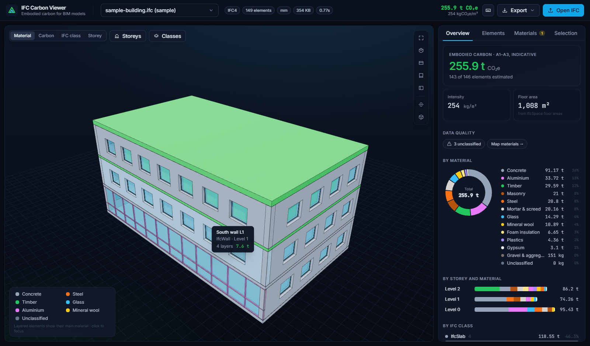
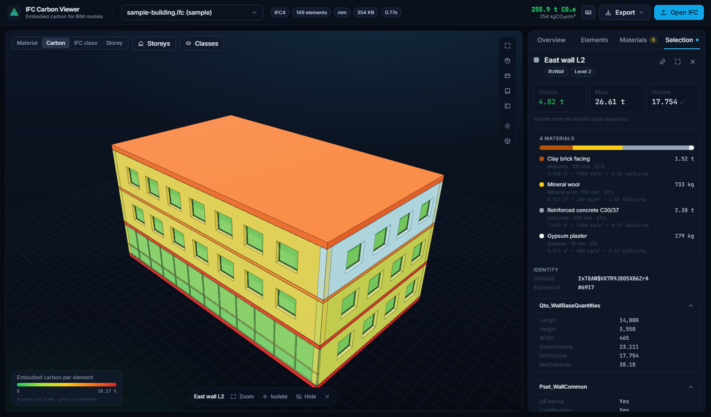
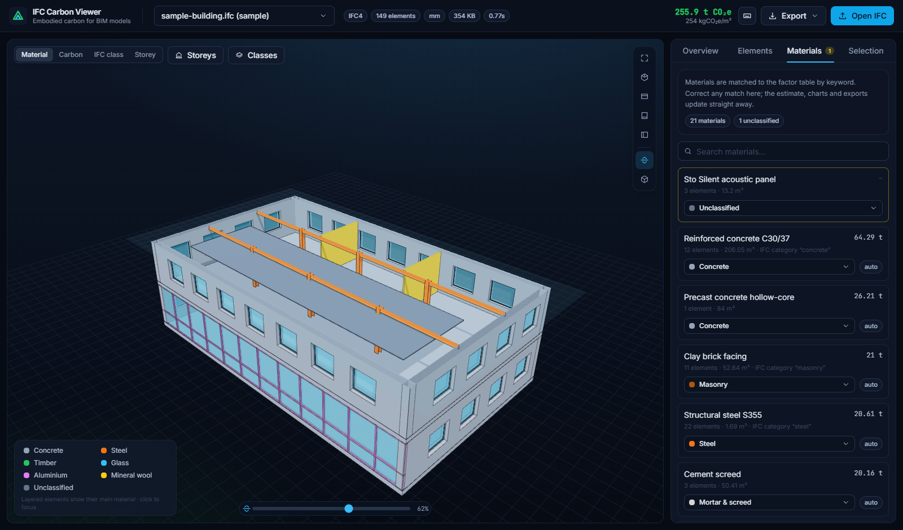
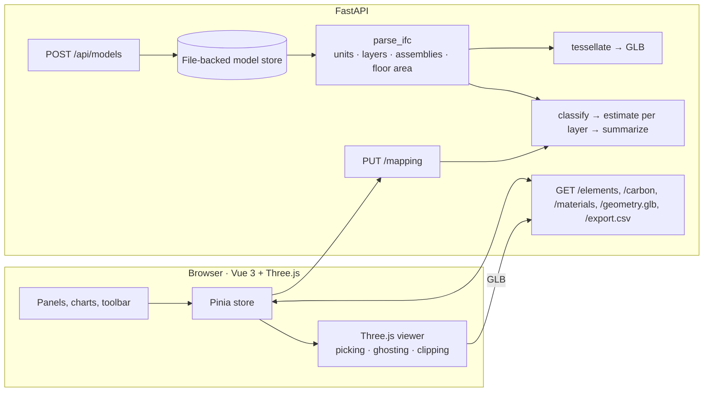

# IFC Carbon Viewer

Open an IFC/BIM model in the browser and see where its embodied carbon is: per element, per material layer, per storey.

The backend parses IFC files with [IfcOpenShell](https://ifcopenshell.org/), tessellates the geometry into a glTF binary and estimates cradle-to-gate carbon from material, density and volume. Layered walls and slabs are split by layer thickness, so a brick wall with mineral wool and plaster is not counted as solid brick. The frontend renders the model with Three.js and lets you explore it: colour by material, carbon, class or storey; click a chart to isolate that part of the building; cut through it with a section plane; correct material matches and watch the numbers update.



<table>
  <tr>
    <td width="50%"></td>
    <td width="50%"></td>
  </tr>
  <tr>
    <td>Carbon colouring, with a layered wall selected</td>
    <td>Section cut and the material mapping panel</td>
  </tr>
</table>

## What it does

**Parsing**

- Reads **IFC2X3, IFC4 and IFC4X3** with IfcOpenShell: spatial tree, storeys, types, materials, property sets and base quantities.
- Handles **units properly**. Lengths, areas and volumes each get their own scale, so the usual Revit/ArchiCAD export (millimetre lengths, cubic-metre volumes) gives the right volumes.
- Reads **material layer sets, constituent sets, profile sets and material lists**. Each element keeps its layers with thickness and volume share.
- Treats **assemblies** (curtain walls, stairs, roofs) as containers. Their carbon is counted once, through their parts.
- Finds the **floor area** from `IfcSpace` quantities, falling back to floor-slab areas or the measured top faces of slabs, and reports **kgCO₂e/m²**.
- Exports geometry as **GLB** with a small dependency-free glTF writer: one node per element, named by GlobalId.

**Estimating**

- `volume × density × factor` per layer, cradle to gate (A1–A3). Volume comes from `Qto_*BaseQuantities` when present and from the tessellated mesh otherwise. Every element records which source was used.
- Materials are matched by keyword against an editable table ([`factors.json`](backend/app/carbon/factors.json)) with 14 categories, from concrete and steel to foam insulation, membranes and gravel.
  - A keyword only matches as a whole word, so "pipe" is not read as an IPE steel section.
  - The most specific keyword wins, so "glass wool" is insulation, not glass.
  - English, Romanian and German names are covered.
- Anything that cannot be classified is reported, not guessed. The **Materials** tab lets you assign a category per material. The mapping is stored per model and the estimate is recomputed on the server without parsing the IFC again.

**Viewer**

- Colour by material, carbon (square-root scale), IFC class or storey. Glass is drawn see-through in the material view.
- **Focus**: click a material in the donut chart or legend, a storey, a class or a data-quality issue. Everything else fades to a faint outline.
- **Section cut** with a height slider, **X-ray**, **isolate / hide** the selection, show or hide storeys and classes.
- Camera presets (iso, top, front, side), animated fit, soft shadows and edge lines.
- Selection panel with the layer breakdown, the calculation for each layer, parent/part navigation and every property set.
- Element list with search, sorting and paging for large models.
- **Exports**: element table as CSV (one row per layer, adds up to the total), JSON report, PNG screenshot.
- Deep links (`?model=…&element=…&color=carbon`), keyboard shortcuts (`?` lists them), drag-and-drop upload with progress, and a layout that works on phones.

**Sample**

A three-storey office is generated with `ifcopenshell.api` ([`make_sample.py`](backend/scripts/make_sample.py)), so the repository ships no third-party IFC. It uses millimetre lengths like a real export and contains:

- layered walls and slabs with windows in real openings;
- windows and a door with constituent sets;
- HEB/IPE steel profiles with no volume quantities, so their volume comes from the geometry;
- a curtain wall, a stair and a roof built as assemblies;
- spaces with floor areas;
- one material the factor table does not know.

## Architecture



| Layer | Stack |
| --- | --- |
| Backend | Python 3.12, FastAPI, Pydantic v2, IfcOpenShell 0.8, NumPy, pytest, ruff, uv |
| Frontend | Vue 3, TypeScript, Vite, Pinia, Tailwind CSS v4, Three.js, Vitest |
| Packaging | Docker (multi-stage), docker compose, GitHub Actions |

### API

| Method | Path | Purpose |
| --- | --- | --- |
| `GET` | `/api/models` | List models with status and summary |
| `POST` | `/api/models` | Upload an `.ifc` (multipart). Returns `202` and parses in the background |
| `GET` | `/api/models/{id}` | Status, counts, storeys, units, total carbon, floor area and intensity |
| `GET` | `/api/models/{id}/elements` | Element summaries with layers; filter by `storey`, `ifc_class`, `material_category` |
| `GET` | `/api/models/{id}/elements/{global_id}` | Full detail with parent/parts, property and quantity sets |
| `GET` | `/api/models/{id}/carbon` | Totals, data-quality counts, breakdowns and top emitters |
| `GET` | `/api/models/{id}/materials` | Every material name with its automatic and effective category |
| `GET` `PUT` | `/api/models/{id}/mapping` | Read or replace the per-model material overrides; `PUT` recomputes the estimate |
| `GET` | `/api/models/{id}/export.csv` | One row per element and material layer |
| `GET` | `/api/models/{id}/report.json` | Model summary, carbon breakdowns and materials |
| `GET` | `/api/models/{id}/geometry.glb` | Tessellated geometry as glTF binary |
| `GET` | `/api/carbon/factors` | The factor table in use |
| `DELETE` | `/api/models/{id}` | Remove a model and its artefacts |

Interactive docs are served at `http://localhost:8000/docs`.

## Running locally

Prerequisites: Python 3.11 or 3.12 (IfcOpenShell wheels are not yet published for 3.13+), Node 20+, and [uv](https://docs.astral.sh/uv/).

```bash
# backend
cd backend
uv sync --all-groups
uv run python scripts/make_sample.py samples/sample-building.ifc   # regenerate the sample if you like
uv run uvicorn app.main:app --reload --port 8000
```

```bash
# frontend (second terminal)
cd frontend
npm install
npm run dev
```

Open `http://localhost:5173`. The sample model is loaded on first start; drop any `.ifc` file on the page to parse your own. Models parsed by v0.1 are parsed again automatically on the first start of v0.2.

Or with Docker:

```bash
docker compose up --build
```

and open `http://localhost:8080`.

### Command line

The parser also works without the API:

```bash
cd backend
uv run python -m app.cli samples/sample-building.ifc --glb out.glb
```

```
sample-building.ifc: IFC4, 149 elements, 0.82s
storeys: Level 0, Level 1, Level 2
length unit: mm
total embodied carbon (indicative): 255.9 tCO2e
floor area: 1,008 m2 (spaces), intensity 254 kgCO2e/m2
unclassified: 3 elements (map their materials in the viewer)
by material category:
  Concrete                 91.2 tCO2e   35.6%  (14 elements)
  Aluminium                33.7 tCO2e   13.2%  (74 elements)
  Timber                   29.6 tCO2e   11.6%  (3 elements)
  Masonry                  21.0 tCO2e    8.2%  (11 elements)
  Steel                    20.8 tCO2e    8.1%  (23 elements)
  ...
```

## Tests

```bash
cd backend && uv run pytest          # units, layers, assemblies, classification, mapping, exports, API round trip
cd frontend && npm test              # colour scales, formatting, focus matching, storey stacks
cd frontend && npm run typecheck     # vue-tsc, strict
```

CI runs ruff, pytest, vue-tsc, Vitest, the production build and both Docker image builds on every push and pull request.

## About the carbon numbers

The factors are generic, order-of-magnitude cradle-to-gate values in the range published by public databases such as the ICE database. They are meant to show *where* the carbon is in a model, not to produce a reportable figure. For a real assessment you would:

- replace the factor table with product-specific EPD values,
- add life-cycle stages beyond A1–A3 (transport, construction, use, end of life),
- account for reinforcement in concrete and biogenic carbon in timber explicitly,
- validate quantities against the model's quantity take-off rather than trusting either source blindly.

Swapping the factor table or the classification rule is a one-file change, and the per-model mapping covers the cases a keyword cannot.

## Configuration

| Variable | Default | Meaning |
| --- | --- | --- |
| `IFC_DATA_DIR` | `backend/data` | Where uploaded models and derived artefacts are stored |
| `IFC_SAMPLE_PATH` | `backend/samples/sample-building.ifc` | Sample loaded on first start |
| `IFC_PRELOAD_SAMPLE` | `true` | Set to `false` to start empty |
| `IFC_MAX_UPLOAD_MB` | `200` | Upload size limit |
| `IFC_CORS_ORIGINS` | `http://localhost:5173` | Comma-separated allowed origins |
| `VITE_API_BASE` | *(empty, same origin)* | Frontend: API base URL when not proxied |

## Limitations and ideas

- Parsing runs in a background task inside the API process; a very large model occupies one worker while it parses. A queue (Celery, arq) would be the next step for production use.
- One colour per element: layered elements show their main material. The layer split is in the selection panel and the exports.
- A section cut shows the inside of walls hollow; drawing caps would need stencil-based capping.
- Windows and doors without volume quantities rely on their geometry, which depends on how detailed the authoring tool made them.
- Possible extensions: life-cycle stages beyond A1–A3, EPD import, comparing two design options of the same building, BCF issues for unclassified elements.

See [CHANGELOG.md](CHANGELOG.md) for what changed between versions.

## License

[MIT](LICENSE)
