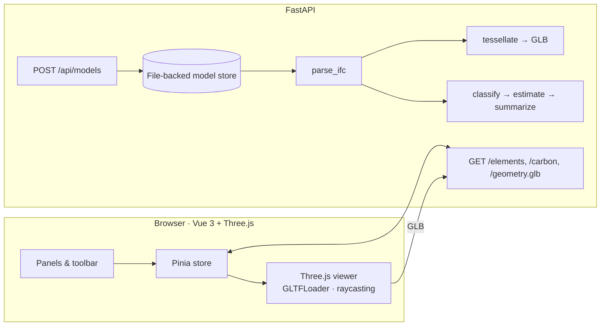

# IFC Carbon Viewer

Browse IFC/BIM models in the browser and see an indicative embodied-carbon estimate for every element.

The backend parses IFC files with [IfcOpenShell](https://ifcopenshell.org/), tessellates the geometry into a glTF binary and computes per-element carbon from material category, density and volume. The frontend renders the model with Three.js, lets you colour it by material, carbon or IFC class, filter by storey and class, and inspect any element's property and quantity sets.


## What it does

- **Parses IFC2X3 / IFC4 / IFC4X3** with IfcOpenShell: spatial tree, storeys, element types, materials, property sets and base quantities.
- **Exports geometry as GLB** using a small dependency-free glTF writer. One node per element (named by GlobalId) so the viewer can pick and recolour elements individually. Flat per-face normals and a Z-up to Y-up conversion are handled server-side.
- **Estimates embodied carbon (A1–A3)** per element: `volume × density × factor`. Volume comes from `Qto_*BaseQuantities` when the model has them and from the tessellated mesh (signed tetrahedron volume) when it does not. Every element records which source was used.
- **Classifies materials** by keyword against an editable factor table ([`backend/app/carbon/factors.json`](backend/app/carbon/factors.json)). Elements that cannot be classified are reported as such instead of silently receiving a default factor.
- **Interactive viewer**: orbit/pan/zoom, hover tooltips, click to select, colour modes, storey and class filters, fit-to-view, breakdowns by material, storey and class, and a "largest contributors" list.
- **Drag-and-drop upload** of your own IFC files. Parsing runs in the background and the UI polls until the model is ready.
- **Self-contained sample**: a two-storey building is generated with `ifcopenshell.api` (walls, slabs, columns, a curtain wall and a roof, with materials and quantities), so the repository ships no third-party IFC.

## Architecture



| Layer | Stack |
| --- | --- |
| Backend | Python 3.12, FastAPI, Pydantic v2, IfcOpenShell 0.8, NumPy, pytest, ruff, uv |
| Frontend | Vue 3, TypeScript, Vite, Pinia, Tailwind CSS v4, Three.js, Vitest |
| Packaging | Docker (multi-stage), docker compose, GitHub Actions |

### API

| Method | Path | Purpose |
| --- | --- | --- |
| `GET` | `/api/models` | List models with status and summary |
| `POST` | `/api/models` | Upload an `.ifc` (multipart). Returns `202` and parses in the background |
| `GET` | `/api/models/{id}` | Status, element counts, storeys, total carbon |
| `GET` | `/api/models/{id}/elements` | Element summaries; filter by `storey`, `ifc_class`, `material_category` |
| `GET` | `/api/models/{id}/elements/{global_id}` | Full detail with property and quantity sets |
| `GET` | `/api/models/{id}/carbon` | Breakdown by material, storey and class, plus top emitters |
| `GET` | `/api/models/{id}/geometry.glb` | Tessellated geometry as glTF binary |
| `GET` | `/api/carbon/factors` | The factor table in use |
| `DELETE` | `/api/models/{id}` | Remove a model and its artefacts |

Interactive docs are served at `http://localhost:8000/docs`.

## Running locally

Prerequisites: Python 3.11 or 3.12 (IfcOpenShell wheels are not yet published for 3.13+), Node 20+, and [uv](https://docs.astral.sh/uv/).

```bash
# backend
cd backend
uv sync --all-groups
uv run python scripts/make_sample.py samples/sample-building.ifc   # regenerate the sample if you like
uv run uvicorn app.main:app --reload --port 8000
```

```bash
# frontend (second terminal)
cd frontend
npm install
npm run dev
```

Open `http://localhost:5173`. The sample model is loaded on first start; drop any `.ifc` file on the page to parse your own.

Or with Docker:

```bash
docker compose up --build
```

and open `http://localhost:8080`.

### Command line

The parser also works without the API:

```bash
cd backend
uv run python -m app.cli samples/sample-building.ifc --glb out.glb
```

```
sample-building.ifc: IFC4, 19 elements, 0.03s
storeys: Level 0, Level 1
total embodied carbon (indicative): 55.3 tCO2e
by material category:
  Masonry            24.0 tCO2e   43.4%  (7 elements)
  Timber             10.6 tCO2e   19.1%  (2 elements)
  Concrete            7.5 tCO2e   13.5%  (1 elements)
  Steel               6.9 tCO2e   12.5%  (8 elements)
  Glass               6.4 tCO2e   11.5%  (1 elements)
```

## Tests

```bash
cd backend && uv run pytest          # parser, GLB writer, carbon maths, API round trip
cd frontend && npm test              # colour scale and formatting helpers
cd frontend && npm run typecheck     # vue-tsc, strict
```

CI runs ruff, pytest, vue-tsc, Vitest, the production build and both Docker image builds on every push and pull request.

## About the carbon numbers

The factors are generic, order-of-magnitude cradle-to-gate values in the range published by public databases such as the ICE database. They are meant to show *where* the carbon is in a model, not to produce a reportable figure. For a real assessment you would:

- replace the factor table with product-specific EPD values,
- add life-cycle stages beyond A1–A3 (transport, construction, use, end of life),
- account for reinforcement in concrete and biogenic carbon in timber explicitly,
- validate quantities against the model's quantity take-off rather than trusting either source blindly.

The code is structured so that swapping the factor table or the classification rule is a one-file change.

## Configuration

| Variable | Default | Meaning |
| --- | --- | --- |
| `IFC_DATA_DIR` | `backend/data` | Where uploaded models and derived artefacts are stored |
| `IFC_SAMPLE_PATH` | `backend/samples/sample-building.ifc` | Sample loaded on first start |
| `IFC_PRELOAD_SAMPLE` | `true` | Set to `false` to start empty |
| `IFC_MAX_UPLOAD_MB` | `200` | Upload size limit |
| `IFC_CORS_ORIGINS` | `http://localhost:5173` | Comma-separated allowed origins |
| `VITE_API_BASE` | *(empty, same origin)* | Frontend: API base URL when not proxied |

## Limitations and ideas

- Parsing is synchronous inside a background task; a large model blocks one worker. A queue (Celery, arq) would be the next step for production use.
- One colour per element: elements with several material layers get the colour of the dominant layer. Per-face colours would need a second material channel in the GLB.
- Property sets are stored as JSON per model; a database would make cross-model queries possible.
- Possible extensions: material layer thicknesses from `IfcMaterialLayerSet`, per-storey floor-area intensities (kgCO₂e/m²), export of the element table to CSV/XLSX, IFC diffing between design options.

## License

[MIT](LICENSE)
